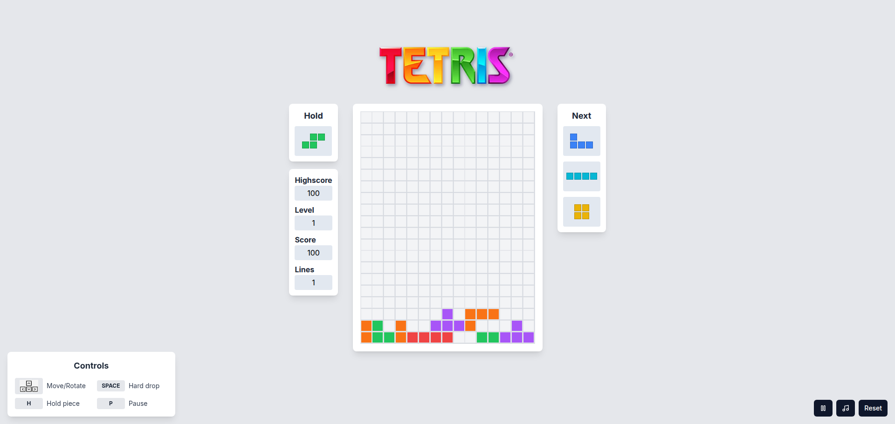

<div align="center" style="border-radius: 10px; box-shadow: 0 0 20px rgba(0,255,255,0.5);">


[](https://nextjs.org/)
[](https://react.dev/)
[](https://www.typescriptlang.org/)
[](https://tailwindcss.com/)
[](https://www.framer.com/motion/)

</div>

---

<div align="center">

## **UM TETRIS MODERNO COM ESTILO GAMER**

_Experimente a nostalgia dos clássicos com a tecnologia moderna!_

</div>

## **CAPTURAS DO JOGO**

<div align="center">

### **TELA PRINCIPAL**



### **GAMEPLAY EM AÇÃO**


</div>

---

## **TECNOLOGIAS UTILIZADAS**

<div align="center">

|                                                **Frontend**                                                |                                                       **Styling**                                                       |                                                   **Animation**                                                   |                                                  **Development**                                                  |
| :--------------------------------------------------------------------------------------------------------: | :---------------------------------------------------------------------------------------------------------------------: | :---------------------------------------------------------------------------------------------------------------: | :---------------------------------------------------------------------------------------------------------------: |
|  |  |  |  |
|         |                          |                              |           |

</div>

---

## **RECURSOS ESPECIAIS**

### **INTERFACE MODERNA**

- Design responsivo com Tailwind CSS
- Animações fluidas com Framer Motion
- Visual limpo e moderno
- Efeitos visuais ao limpar linhas

### **MECÂNICAS AVANÇADAS**

- Sistema de Hold (segurar peça)
- Preview das próximas 3 peças
- Hard Drop (queda instantânea)
- Wall Kick para rotações
- Aumento progressivo de velocidade

### **EXPERIÊNCIA IMERSIVA**

- Música de fundo nostálgica
- Controles de áudio integrados
- Sistema de pause
- Highscore persistente

### **PERFORMANCE**

- 60 FPS constantes
- Otimizado com React 19
- Bundle otimizado com Next.js

---

## **COMO JOGAR**

<div align="center">

### **CONTROLES**

|   Tecla    |        Ação         |
| :--------: | :-----------------: |
| **⬅️ ➡️**  |     Mover peça      |
|   **⬆️**   |     Rotacionar      |
|   **⬇️**   |   Acelerar queda    |
| **ESPAÇO** |      Hard Drop      |
|   **H**    | Hold (Segurar peça) |
|   **P**    |     Pausar jogo     |

</div>

### **SISTEMA DE PONTUAÇÃO**

- **1 linha** = 100 pontos
- **2 linhas** = 300 pontos
- **3 linhas** = 500 pontos
- **4 linhas (Tetris)** = 800 pontos

### **PROGRESSÃO**

- A cada 10 linhas completadas = +1 Level
- Velocidade aumenta gradualmente
- Desafio crescente para testar suas habilidades!

---

## **QUICK START**

### **PRÉ-REQUISITOS**

- Node.js 18+
- npm, yarn, pnpm ou bun

### **INSTALAÇÃO RÁPIDA**

```bash
# Clone o repositório
git clone https://github.com/RogerioCordeiro/tetris.git

# Entre no diretório
cd tetris

# Instale as dependências
npm install
# ou
yarn install
# ou
pnpm install

# Execute o projeto
npm run dev
# ou
yarn dev
# ou
pnpm dev
```

### **ACESSO**

Abra [http://localhost:3000](http://localhost:3000) no seu navegador e divirta-se!

---

## **COMANDOS DISPONÍVEIS**

```bash
npm run dev      # Modo desenvolvimento
npm run build    # Build para produção
npm run start    # Iniciar em produção
npm run lint     # Verificar código
```

---

## **COMO CONTRIBUIR**

### **FORK & CONTRIBUTE**

1. **Fork** este repositório
2. **Clone** seu fork:
   ```bash
   git clone https://github.com/SEU-USUARIO/tetris.git
   ```
3. **Crie** uma branch para sua feature:
   ```bash
   git checkout -b feature/minha-feature-incrivel
   ```
4. **Faça** suas alterações e commit:
   ```bash
   git commit -m "Adicionei uma feature incrível"
   ```
5. **Envie** para seu fork:
   ```bash
   git push origin feature/minha-feature-incrivel
   ```
6. **Abra** um Pull Request!

### **IDEIAS PARA CONTRIBUIÇÃO**

- Novos efeitos sonoros
- Themes e skins personalizados
- Sistema de conquistas
- Modo multiplayer
- Melhorias na responsividade
- Internacionalização

---

## **COMPATIBILIDADE**

<div align="center">

|   Desktop   |     Mobile      |     Tablet      |
| :---------: | :-------------: | :-------------: |
| Chrome 90+  |  Chrome Mobile  |      iPad       |
| Firefox 88+ |   Safari iOS    | Android Tablets |
| Safari 14+  |   Edge Mobile   |     Surface     |
|  Edge 90+   | Outros browsers | Outros tablets  |

</div>

---

## **LICENÇA**

Este projeto está sob a licença MIT. Veja o arquivo `LICENSE` para mais detalhes.

---

## **DESENVOLVIDO POR**

<div align="center">

**[Rogério Cordeiro](https://github.com/RogerioCordeiro)**

_Se você curtiu o projeto, não esqueça de dar uma estrela!_

[](https://github.com/RogerioCordeiro)

</div>

---

<div align="center">

### **GAME ON!**

_"The only way to win at Tetris is to never stop playing!"_

---

**FEITO COM TECNOLOGIA MODERNA PARA UMA EXPERIÊNCIA NOSTÁLGICA**

</div>
